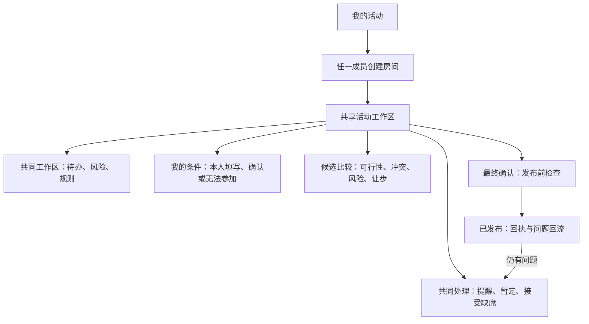
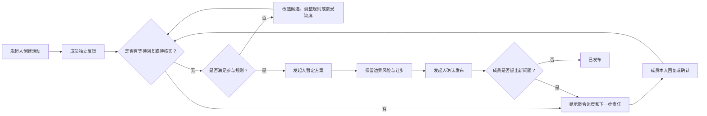

# ChoiceMesh 信息架构与中保真任务流

| 字段 | 内容 |
|---|---|
| 版本 | V1.1 |
| 日期 | 2026-08-06 |
| 依据 | `02_ChoiceMesh_MVP需求与流程规格_V1.md` |
| 目标 | 把 MVP 状态模型转为可操作的信息架构与任务流，而非视觉定稿 |

## 1. 信息架构

### 1.1 工作区层级

| 层级 | 内容 | 面向谁 |
|---|---|---|
| 房间级 | 标题、活动日期、参与规则、房间状态、候选数量 | 全体 |
| 成员级 | 回复状态、本人条件、确认或无法参加操作 | 全体仅见匿名聚合；每人仅可读取和编辑自己的条件 |
| 候选级 | 硬冲突、待核实、边界风险、偏好让步、下一步 | 全体仅见聚合行动提示 |
| 决策级 | 暂定、发布、回执、协调中历史 | 任一成员发布；全体查看 |

## 2. 首要任务流：从“群聊僵局”到正式发布

## 3. 页面职责与关键决策

| 页面 | 用户要完成的事 | 关键内容 | 不应出现的行为 |
|---|---|---|---|
| 概览 | 知道活动当前卡在哪里 | 参与规则、回复进度、聚合风险、下一步 | 用一堆个人理由制造社交压力 |
| 成员反馈 | 为自己提供或确认条件 | 日常语言、本人确认、隐私选择 | AI 自动把模糊语句变成确认 |
| 候选比较 | 判断哪一个可推进 | 不可行 / 待处理 / 可发布；风险与让步 | 自动宣布“最佳方案” |
| 协调处理 | 解决卡点或记录选择 | 私密提醒、暂定、改选、接受缺席 | 发起人替成员填报或确认 |
| 最终确认 | 把暂定变成正式结果 | 规则门槛、保留风险、明确发布动作 | 将沉默视为同意 |

共同页面的“谁处理下一步”必须是匿名类别，例如“等待 1 位成员反馈”或“等待 1 项条件由本人核实”，而不是成员姓名或可识别的归属。“我的条件”由受邀成员身份绑定，在正式产品中由服务端授权；同一套界面不等于同一份可读数据。
| 已发布 | 留下最终摘要并容纳新问题 | 回执、版本记录、回到协调中 | 掩盖已知风险 |

## 4. 中保真原型覆盖范围

原型使用一个四人周末活动的模拟房间，覆盖以下可用性任务：

1. 识别“等待回复”和“待核实”是两条不同状态；
2. 由对应成员完成回复或确认，发起人仅记录回执；
3. 比较候选 C 的待处理项与已验证边界风险；
4. 暂定方案并在条件满足后发布；
5. 在发布后提交“仍有问题”，使房间回到协调中。

原型不模拟真实 AI、账号、网络同步或外部地点数据。

## 5. 下一轮可用性测试任务

给参与者一个“有成员尚未回复、另一成员正在核实通勤、预算压线”的周末活动情境，要求其：

1. 说出当前阻止发布的原因和下一步由谁完成；
2. 将活动推进到可发布并完成发布；
3. 解释边界风险是否阻断发布；
4. 从成员视角提交“仍有问题”，并说出会发生什么。

成功信号：用户无需查看长帮助文字，即能区分状态、理解责任边界，并完成完整闭环。
