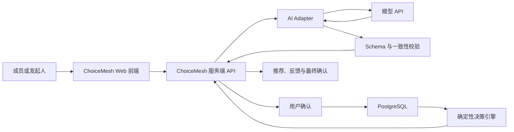

# ChoiceMesh AI 接入架构

> **历史版本说明**：本文件记录包含 AI 推荐解释的早期架构探索。当前 AI 仅用于私密条件草稿，见 [ChoiceMesh AI 能力与产品边界 V2](../AI工程/01_ChoiceMesh_AI能力与产品边界_V2.md)。

| 字段 | 内容 |
|---|---|
| 文档版本 | V1.0 |
| 更新日期 | 2026-08-03 |
| 当前状态 | 待技术验证 |
| 首选接入方式 | 服务端模型 API + Structured Outputs |
| 关联文档 | `01_ChoiceMesh技术方案与验证计划_V1.md`、`../Spec文档/05_ChoiceMesh_AI能力与产品边界_V1.md` |

## 1. 文档目标

定义 ChoiceMesh 的 AI 接入位置、接口边界、数据流、验证方式和降级策略，为后续 PoC 与 Web MVP 开发提供实现基线。

本文件回答三个问题：

1. 哪些任务需要 AI；
2. AI 如何与规则引擎、数据库和前端协作；
3. 如何避免模型错误直接影响共同决策。

## 2. 核心原则

> AI 负责理解和表达，规则引擎负责计算和决定，用户负责确认。

因此：

- AI 不直接访问数据库；
- AI 不拥有最终决策权；
- AI 不修改成员已确认的输入；
- AI 不重新计算候选方案排名；
- AI 输出必须通过 Schema 和业务一致性校验；
- AI 失败时，核心决策流程仍然可以继续。

## 3. 总体架构



### 3.1 关键边界

- 浏览器只调用 ChoiceMesh 自己的后端；
- API Key 只存在于服务器环境变量或托管平台 Secret；
- AI Adapter 屏蔽具体模型提供方差异；
- 规则引擎是独立 TypeScript 模块，不依赖模型；
- 数据库只保存通过用户确认或程序校验的数据。

## 4. MVP 中的 AI 能力

### A1：偏好与约束解析

目的：把成员的自然语言补充转换为结构化建议。

示例输入：

> 周六下午都可以，最好不要超过 40 澳元，Newtown 太远了，我更喜欢室内活动。

示例输出：

```json
{
  "time": {
    "strength": "hard",
    "available": ["Saturday 12:00-18:00"]
  },
  "budget": {
    "strength": "soft",
    "max": 40,
    "currency": "AUD"
  },
  "location": {
    "strength": "hard",
    "excluded_areas": ["Newtown"]
  },
  "activity_type": {
    "strength": "soft",
    "preferred": ["indoor"]
  },
  "clarifications": []
}
```

控制点：

- AI 返回的是 `PreferenceDraft`，不是正式 `Preference`；
- 前端必须显示“AI 识别结果，请检查”；
- 用户可以修改全部字段；
- 只有用户确认后才写入正式偏好表；
- 无法量化的表达进入 `clarifications`，不允许静默猜测。

### A2：澄清问题生成

当输入出现以下情况时，最多生成两个澄清问题：

- “不要太贵”但没有金额；
- “周六都可以”但候选跨越全天；
- “不要太远”但没有区域或通勤时间；
- 同一句话包含相互冲突的条件；
- 无法判断条件属于必须满足还是最好满足。

澄清结果不得写入决策输入，必须等待成员回答。

### A3：推荐取舍解释

目的：将规则引擎的结构化结果转换为成员能理解的说明。

模型只接收：

- 候选方案 ID 和已知字段；
- 可行或不可行状态；
- 规则引擎提供的失败原因；
- 最低个人满意度；
- 平均满意度；
- 共同偏好命中数；
- 保留意见人数。

示例输出：

```json
{
  "candidate_id": "candidate_b",
  "summary": "候选 B 是目前最均衡的可行方案。",
  "advantages": [
    "满足所有成员的必要时间和预算条件",
    "每位成员至少有 75% 的软性偏好得到满足"
  ],
  "tradeoffs": [
    "有一位成员更偏好候选 C 的活动类型"
  ],
  "unresolved_issues": []
}
```

AI 不得：

- 调整规则引擎排名；
- 把不可行方案表述成推荐方案；
- 自行计算或修改百分比；
- 添加数据库中不存在的价格、地址或营业时间；
- 使用“完美”“绝对公平”等无法证明的判断。

### A4：反馈总结

该能力放在 A1 和 A3 稳定之后开发。

结构化反馈如“接受/有保留/不可接受”直接由程序处理。AI 只总结自由文本：

```json
{
  "new_hard_constraints": [],
  "adjustable_preferences": [
    "两位成员希望活动结束时间提前"
  ],
  "candidate_issues": [
    "候选 B 的费用需要确认"
  ],
  "unresolved_conflicts": [],
  "source_feedback_ids": ["feedback_2", "feedback_3"]
}
```

总结必须保留反馈 ID 映射，由发起人检查后才能触发修订。

## 5. 非 AI 能力

以下任务必须由确定性程序完成：

- 时间区间比较；
- 预算上限判断；
- 区域和通勤阈值判断；
- 硬性约束过滤；
- 软性偏好评分；
- 最低个人满意度和平均满意度计算；
- 稳定排序；
- 无解识别；
- 成员提交状态；
- 修订次数限制；
- 全员确认状态。

## 6. 服务端接口

### 6.1 偏好解析

```text
POST /api/ai/parse-preference
```

请求：

```json
{
  "room_id": "room_123",
  "member_token": "opaque-token",
  "locale": "zh-CN",
  "text": "周六下午都可以，最好不要超过40澳元"
}
```

响应：

```json
{
  "status": "needs_confirmation",
  "draft": {},
  "clarifications": [],
  "ai_version": "preference-parser-v1"
}
```

### 6.2 推荐解释

```text
POST /api/ai/explain-decision
```

调用方只能提交 `decision_result_id`。服务端重新读取已验证的计算结果，避免浏览器伪造排名或数字。

### 6.3 反馈总结

```text
POST /api/ai/summarize-feedback
```

仅在一个决策版本的成员反馈收集完成后调用。

### 6.4 规则计算

```text
POST /api/decisions/calculate
```

该接口不调用 AI，只运行确定性决策引擎。

## 7. 建议代码结构

```text
src/
├─ app/api/
│  ├─ ai/
│  │  ├─ parse-preference/route.ts
│  │  ├─ explain-decision/route.ts
│  │  └─ summarize-feedback/route.ts
│  └─ decisions/
│     └─ calculate/route.ts
├─ lib/
│  ├─ ai/
│  │  ├─ client.ts
│  │  ├─ adapter.ts
│  │  ├─ prompts.ts
│  │  ├─ schemas.ts
│  │  ├─ validators.ts
│  │  └─ fallback.ts
│  └─ decision-engine/
│     ├─ constraints.ts
│     ├─ scoring.ts
│     ├─ ranking.ts
│     └─ types.ts
└─ evals/
   ├─ preference-parser/
   ├─ decision-explainer/
   └─ fixtures/
```

## 8. API 接入方式

首个 PoC 建议使用 OpenAI Responses API，并通过 Structured Outputs 将输出限制为 Zod/JSON Schema。

示意代码：

```ts
import OpenAI from "openai";
import { zodTextFormat } from "openai/helpers/zod";
import { PreferenceDraftSchema } from "./schemas";

const openai = new OpenAI();

const response = await openai.responses.parse({
  model: process.env.OPENAI_MODEL!,
  input: [
    {
      role: "system",
      content: preferenceParserPrompt,
    },
    {
      role: "user",
      content: userText,
    },
  ],
  text: {
    format: zodTextFormat(PreferenceDraftSchema, "preference_draft"),
  },
});

const draft = response.output_parsed;
```

模型名称通过 `OPENAI_MODEL` 配置，不在业务代码中散落硬编码。最终模型应通过固定评测集比较质量、延迟和成本后再锁定。

## 9. Prompt 管理

每项能力使用独立 Prompt：

```text
preference-parser-v1
decision-explainer-v1
feedback-summarizer-v1
```

每个 Prompt 明确：

- 任务目标；
- 可使用的输入字段；
- 禁止推断的内容；
- 输出 Schema；
- 澄清条件；
- 拒绝或失败行为；
- 语言和长度要求。

Prompt、Schema、模型和规则引擎分别版本化。修改任一部分都要运行相应回归评测。

## 10. 输出校验

### 10.1 Schema 校验

- 类型正确；
- 必填字段存在；
- 枚举值合法；
- 数值范围合理；
- 未出现未定义字段。

### 10.2 业务一致性校验

推荐解释必须验证：

- `candidate_id` 存在；
- 可行性状态与规则结果一致；
- 所有数字与规则结果相同；
- 不可行方案没有被推荐；
- 取舍说明引用的偏好确实存在；
- 未出现候选方案中不存在的事实。

校验失败时丢弃模型文本并使用模板解释。

## 11. 安全与隐私

- API Key 只保存在服务器环境变量或托管平台 Secret；
- `.env` 不进入 GitHub；
- 浏览器、移动端和小程序中不得包含 API Key；
- 请求先验证房间和成员 Token；
- 输入设置长度和调用频率限制；
- 解释阶段只发送聚合结果；
- 自由文本进入模型前删除无关个人信息；
- 不发送精确住址、私人日历、联系方式或真实姓名；
- 公开 Demo 只使用合成数据；
- 日志记录版本、延迟、成本和错误类型，不记录完整自由文本。

## 12. 降级策略

| 失败 | 用户体验 | 系统行为 |
|---|---|---|
| 偏好解析失败 | 显示手动表单 | 不保存 AI 草稿 |
| 输出不符合 Schema | 提示重新填写或重试 | 记录解析错误 |
| 解释生成失败 | 显示模板说明 | 保留规则计算结果 |
| 一致性校验失败 | 不显示 AI 文本 | 回退模板并记录 S1 |
| 模型超时 | 提示稍后重试 | 不重复无限调用 |
| 达到调用限制 | 继续使用手动流程 | 阻止额外 AI 请求 |

AI 服务不可用时，房间创建、结构化表单、规则计算、反馈和最终确认仍应工作。

## 13. 调用与成本控制

一个房间的预期调用：

```text
每位选择自然语言输入的成员：最多 1 次解析
每次生成决策结果：1 次解释
一次修订：最多再 1 次解释
反馈总结：V1 后期最多 1 次
```

控制措施：

- 结构化字段不调用 AI；
- 相同输入和版本可使用结果缓存；
- 限制自由文本长度；
- 限制每个成员的重试次数；
- 记录单次和单房间 Token、延迟与估算成本；
- 先用高质量模型建立基线，再测试更低成本模型。

## 14. 评测门槛

### 偏好解析

- 字段级 F1 ≥ 0.90；
- 硬性约束召回率 ≥ 0.98；
- 约束强度准确率 ≥ 0.95；
- 需要澄清的表达识别率 ≥ 0.90；
- 未确认数据写入正式偏好：0 次。

### 推荐解释

- 与计算结果一致率 ≥ 95%；
- 关键数字准确率 100%；
- 新增无依据事实 0 次；
- 不可行方案被推荐 0 次；
- S0/S1 错误在公开发布前为 0。

具体评测集设计见 `../Spec文档/04_ChoiceMesh成功指标与评测框架_V1.md`。

## 15. 实施顺序

### AI-PoC 1：偏好解析

- 定义 `PreferenceDraftSchema`；
- 创建 30 条中英文合成样例；
- 实现服务端解析接口；
- 实现用户确认页面；
- 记录字段级错误。

### AI-PoC 2：推荐解释

- 定义 `DecisionExplanationSchema`；
- 准备 15 个规则计算结果；
- 实现解释接口；
- 实现一致性校验；
- 实现模板降级。

### AI-PoC 3：反馈总结

- 仅在前两项达到门槛后进行；
- 优先验证是否真的比规则分类有增量价值。

## 16. MVP 不采用的 AI 技术

- 不使用 RAG 或向量数据库；
- 不使用多 Agent；
- 不进行模型微调；
- 不自动联网发现活动；
- 不让模型读取群聊；
- 不提供长期对话记忆；
- 不让 AI 自动预订、支付或发送消息。

这些能力只有在用户研究和后续指标证明其必要性后才重新评估。

## 17. 待决策项

- PoC 使用的具体模型与成本上限；
- AI 请求是否默认不保存；
- 房间数据和 AI 日志保存期限；
- 自然语言入口是否默认展开；
- 是否支持中英文混合输入；
- 模板解释是否能够满足部分用户而不调用模型。

## 18. 官方参考资料

访问日期：2026-08-03。

- OpenAI Structured Outputs：<https://developers.openai.com/api/docs/guides/structured-outputs>
- OpenAI API Quickstart：<https://developers.openai.com/api/docs/quickstart>
- OpenAI API Key Safety：<https://help.openai.com/en/articles/5112595-best-practices-for-api-key-safet>
