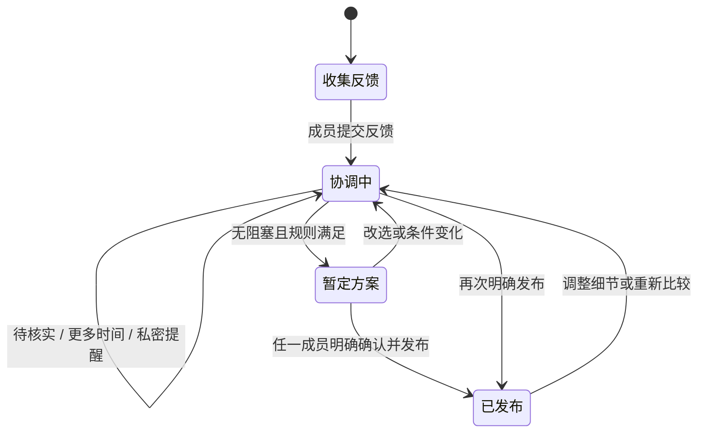

# ChoiceMesh 高保真页面与交互规格

| 字段 | 内容 |
|---|---|
| 版本 | V1 |
| 日期 | 2026-08-07 |
| 状态 | 首版高保真原型已输出，待回测 |
| 依据 | MVP 需求规格 V1.3、确认性中保真回测、V1.3 迭代原型 |
| 原型 | `产出/交付物/产品原型/04_ChoiceMesh_高保真原型_V1/index.html` |

## 1. 信息架构与权限边界

```text
房间
├─ 当前待办（共同、匿名汇总）
├─ 我的条件（当前成员私有）
├─ 候选比较（共同、匿名汇总）
├─ 发布检查（共同、匿名汇总 + 任一成员明确确认）
└─ 已发布 / 回执（共同、匿名汇总 + 版本保留）
```

- 创建房间的人只在创建时录入初始信息，之后没有额外读取或改写权限；
- 共同页面不能显示成员姓名、未回复归属、私人原因、路线或具体预算；
- “我的条件”必须由服务端的受邀链接 / 登录身份决定，不能依赖前端隐藏或切换控件；
- 任何成员可提醒、暂定、接受缺席和发布；只有条件所属成员可确认、保留待核实或声明无法参加。

## 2. 页面规格

### A. 当前待办

**目的**：先显示行动，再显示匿名房间状态。

| 区块 | 内容 | 交互与状态 |
|---|---|---|
| 页首计数 | “现在要处理：N 项”“已反馈：x/y”“只需知情：N 项风险” | 行动数只计算等待回复、待本人核实、等待接受缺席；风险不得计入。 |
| 等待反馈卡 | “回”图标、`等待 N 位成员提交第一条反馈` | 可发送私密提醒；发送后显示已提醒和冷却，不能代为提交。 |
| 本人核实卡 | “核”图标、`你的 N 项条件已回复，待你核实` | 主按钮进入“我的条件”；不能替其他成员操作。 |
| 缺席决策卡 | `有 N 位成员无法参加` | 只有满足既定规则时才允许进入候选比较并接受缺席。 |
| 风险知情卡 | “险”图标、`只需知情：存在已验证风险` | 无主按钮；说明它不阻止推进，详情在候选比较呈现。 |
| 房间状态 | 已确认 / 等待回复 / 待本人核实 / 边界风险 | 全为匿名汇总；等待与核实必须显示不同图标和责任主语。 |

空状态：必要条件满足后，首屏主标题改为“可以暂定候选 C”，把行动引导到候选比较；不得自动发布。

### B. 我的条件

**目的**：成员对自己已回复但未验证的信息作明确选择。

| 元素 | 高保真行为 |
|---|---|
| 隐私眉标 | 固定显示“我的条件 · 仅你可见”；配一句“创建者也不能读取或修改你的原始条件”。 |
| AI 草稿 | 显示为“待确认的草稿”，不是事实；成员必须选动作才改变计算状态。 |
| 保留待核实 | 保持待核实，不计为确认。 |
| 需要更多时间 | 内联展开 `datetime` 输入，由成员输入预计时间；保存后共同页仅显示“有预计时间”。到期不自动转确认或缺席。 |
| 确认无法参加 | 记录匿名缺席，返回共同的接受缺席 / 改选决策；不要求公开理由。 |
| 我已核实，可以参加 | 记录本人确认；移除待核实和预计时间。 |

### C. 候选比较

**目的**：排除硬冲突，解释可推进候选需要的下一步。

- 候选顺序：可推进优先，硬冲突候选置后但仍可查阅；系统不自动选定候选；
- 每个候选必须显示：状态、已反馈人数、阻塞类型、匿名条件覆盖、保留的风险 / 偏好；
- 待核实单元显示“由成员本人处理”；等待反馈显示“需等待本人提交”；
- 当有效参与人数 `< 4`，风险单元只显示“存在已验证风险”，不显示类别、归属、原因或数值；
- 暂定仅在无阻塞且规则满足时可用；暂定不通知成员，跳转发布检查；
- 发布后重新比较且无候选时，显示三个明确去向：新增候选、调整当前候选、结束本次协调；此前发布版本必须被保留。

### D. 发布检查

**目的**：把“考虑中”与“正式决定”切开。

- 逐项显示：实际确认人数、成行规则 / 最低门槛、是否仍有待处理项、已验证风险；
- `我确认：现在发布会将方案标为已确认并通知所有成员；它不再只是“考虑中”。` 必须勾选后，发布按钮才可用；
- 发布是可追溯通知动作，不等于后续永不可调整；如果有人提出问题，仍保留当前版本并回到协调。

### E. 已发布与回执

**目的**：显示结果的真实边界，并提供两种恢复路径。

| 动作 | 优先级 | 结果 |
|---|---|---|
| 收到 | 次要 | 只记录回执，不改变已发布状态。 |
| 调整当前方案细节 | 主操作 | 回到协调，围绕时间、地点、费用等当前方案内变量检查影响；保留版本。 |
| 重新比较候选 | 次操作 | 回到候选比较；若没有可推进候选，呈现新增 / 调整 / 结束三条去向；保留版本。 |

## 3. 关键状态转换



禁止的自动转换：

- 提醒不得使“等待回复”变为“已反馈”；
- “应该可以”不得变为“已确认”；
- 预计时间到期不得变为“无法参加”或“已确认”；
- 边界风险不得因发布而消失；
- 缺席不得自动被接受。

## 4. 高保真交付与回测范围

高保真原型至少需覆盖以下场景的桌面与窄屏状态：

1. 首屏同时存在等待反馈、待本人核实和边界风险；
2. 本人输入预计确认时间后，群体侧只显示匿名存在；
3. 发送提醒后的冷却状态；
4. 3 人规则接受缺席后的风险类别降精度；
5. 暂定、明确发布和已发布版本；
6. 发布后先调整细节、再重新比较无备选的分流。

下一轮高保真回测问题：

- 用户能否在不读长说明时识别“我现在要做什么”与“我只需知道什么”；
- 用户是否理解可编辑预计时间不会自动产生确认或缺席；
- 用户是否能感知提醒的冷却而不误以为催促改变了对方状态；
- 用户是否仍能在小群体状态下相信风险存在，同时不觉得个人被暴露；
- 用户是否把“调整细节”理解为发布后的默认、较轻量恢复路径。
